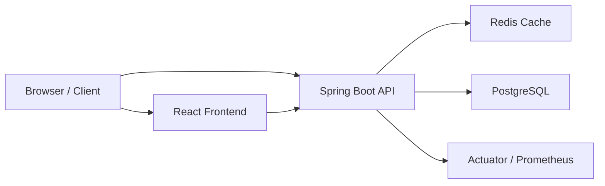
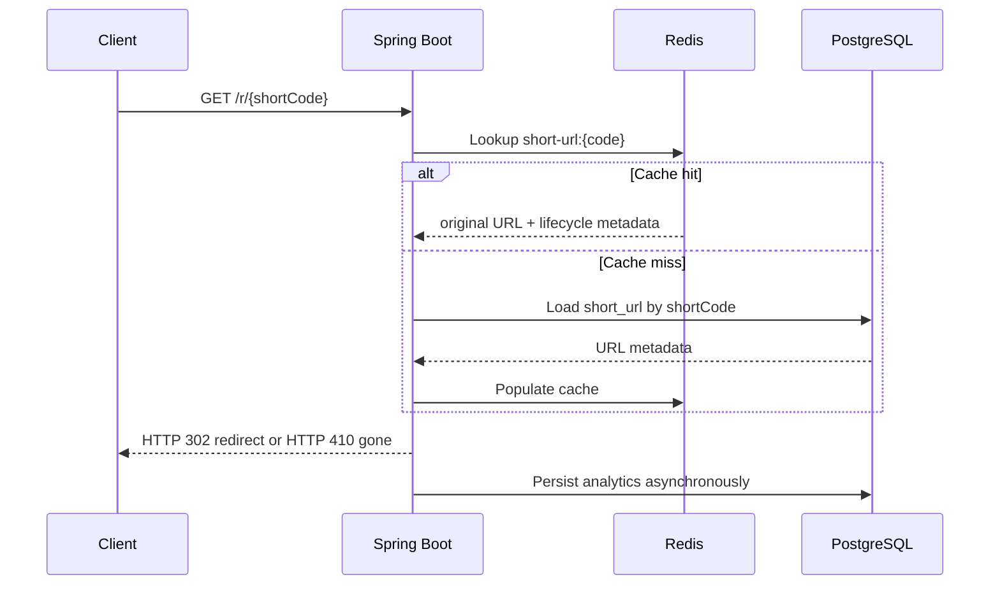
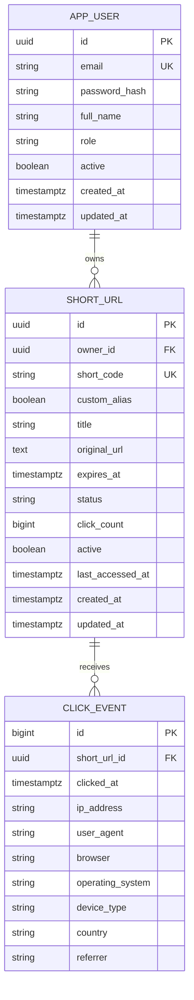

# Distributed URL Shortener System

Production-style, interview-ready URL Shortener System inspired by Bitly, built with Spring Boot, PostgreSQL, Redis, React, Docker, Flyway, JWT Authentication, and Swagger/OpenAPI.

This project is designed to demonstrate backend engineering, system design, caching, analytics, authentication, database design, observability, and deployment readiness for interviews at companies such as Amazon, Microsoft, Snowflake, Cisco, JPMorgan Chase, Uber, Atlassian, and Google.

## Features

- User registration and login with JWT authentication
- Per-user URL ownership and protected dashboard APIs
- Base62 short-code generation backed by PostgreSQL sequence
- Custom alias support
- URL expiration support
- URL lifecycle status management:
  - `ACTIVE`
  - `INACTIVE`
  - `EXPIRED`
- Redirect handling with Redis cache-aside lookup
- Analytics capture for:
  - clicks
  - browser
  - operating system
  - device type
  - approximate country
  - timestamp
  - referrer
- Dashboard metrics and per-URL analytics
- Search, filter, sort, and pagination
- QR code generation
- Swagger/OpenAPI documentation
- Flyway migrations
- Docker Compose local deployment
- Render deployment blueprint

## Tech Stack

### Backend

- Java 25
- Spring Boot 3.5
- Spring Security
- Spring Data JPA
- PostgreSQL
- Redis
- Flyway
- Bucket4j
- JJWT
- Springdoc OpenAPI
- Micrometer / Prometheus endpoint
- JUnit 5
- Mockito
- Testcontainers

### Frontend

- React 19
- TypeScript
- Vite
- Material UI
- Recharts
- Axios
- React Router

### Infrastructure

- Docker
- Docker Compose
- Render
- Kubernetes manifests

## Architecture



### Redirect Flow



## Project Structure

```text
URL Shortener System/
|-- backend/
|   |-- src/main/java/com/urlshortener/
|   |-- src/main/resources/
|   |-- src/test/java/com/urlshortener/
|   `-- Dockerfile
|-- frontend/
|   |-- src/
|   `-- Dockerfile
|-- k8s/
|-- docker-compose.yml
|-- render.yaml
`-- README.md
```

## Database Schema



## Environment Variables

Examples are available in:

- [./.env.example](D:/System%20Design%20Project/URL%20Shortener%20System/.env.example)
- [./backend/.env.example](D:/System%20Design%20Project/URL%20Shortener%20System/backend/.env.example)
- [./frontend/.env.example](D:/System%20Design%20Project/URL%20Shortener%20System/frontend/.env.example)

Important runtime variables:

- `SPRING_DATASOURCE_URL`
- `SPRING_DATASOURCE_USERNAME`
- `SPRING_DATASOURCE_PASSWORD`
- `REDIS_HOST`
- `REDIS_PORT`
- `REDIS_PASSWORD`
- `JWT_SECRET`
- `FRONTEND_URL`
- `SHORT_BASE_URL`
- `VITE_API_BASE_URL`

## Prerequisites

To run locally, install:

- Docker Desktop
- Java 25
- Node.js 24+
- npm

## Quick Start

The easiest way to run the entire project is with Docker Compose.

### 1. Open the project folder

From PowerShell:

```powershell
cd "D:\System Design Project\URL Shortener System"
```

### 2. Start the full stack

```powershell
docker compose up --build
```

This starts:

- PostgreSQL
- Redis
- Spring Boot backend
- React frontend

### 3. Open the app

- Frontend: [http://localhost:3000](http://localhost:3000)
- Backend API: [http://localhost:8080](http://localhost:8080)
- Swagger UI: [http://localhost:8080/swagger-ui.html](http://localhost:8080/swagger-ui.html)
- Health Check: [http://localhost:8080/actuator/health](http://localhost:8080/actuator/health)

### 4. Register a user

There is no pre-seeded app user by default. Register a new account from the frontend and then log in.

## Default Local Infrastructure Credentials

These credentials are for local PostgreSQL and Redis when using Docker Compose:

- PostgreSQL host: `localhost`
- PostgreSQL port: `5432`
- PostgreSQL database: `urlshortener`
- PostgreSQL username: `urlshortener`
- PostgreSQL password: `urlshortener`

- Redis host: `localhost`
- Redis port: `6379`

## Run Without Docker

If you want to run services manually:

### 1. Start PostgreSQL and Redis

Make sure PostgreSQL is available on:

- `localhost:5432`
- database `urlshortener`
- user `urlshortener`
- password `urlshortener`

Make sure Redis is available on:

- `localhost:6379`

### 2. Run the backend

```powershell
cd "D:\System Design Project\URL Shortener System\backend"
.\gradlew.bat bootRun
```

### 3. Run the frontend

Open a second terminal:

```powershell
cd "D:\System Design Project\URL Shortener System\frontend"
npm install
npm run dev
```

When using Vite dev mode:

- Frontend: [http://localhost:5173](http://localhost:5173)
- Backend: [http://localhost:8080](http://localhost:8080)

## Exact Commands You’ll Commonly Need

### Start everything

```powershell
docker compose up --build
```

### Start in background

```powershell
docker compose up -d --build
```

### Stop everything

```powershell
docker compose down
```

### Stop and remove volumes

Warning: this deletes local PostgreSQL and Redis data.

```powershell
docker compose down -v
```

### Rebuild just backend and frontend

```powershell
docker compose up -d --build backend frontend
```

### View running containers

```powershell
docker compose ps
```

### View backend logs

```powershell
docker compose logs -f backend
```

### View frontend logs

```powershell
docker compose logs -f frontend
```

### View PostgreSQL logs

```powershell
docker compose logs -f postgres
```

### View Redis logs

```powershell
docker compose logs -f redis
```

## Backend Commands

```powershell
cd "D:\System Design Project\URL Shortener System\backend"
.\gradlew.bat test
```

```powershell
cd "D:\System Design Project\URL Shortener System\backend"
.\gradlew.bat bootRun
```

```powershell
cd "D:\System Design Project\URL Shortener System\backend"
.\gradlew.bat clean build
```

## Frontend Commands

```powershell
cd "D:\System Design Project\URL Shortener System\frontend"
npm install
```

```powershell
cd "D:\System Design Project\URL Shortener System\frontend"
npm run dev
```

```powershell
cd "D:\System Design Project\URL Shortener System\frontend"
npm run build
```

## Database Commands

### Open PostgreSQL shell inside Docker

```powershell
docker compose exec postgres psql -U urlshortener -d urlshortener
```

### List databases

```sql
\l
```

### List tables

```sql
\dt
```

### Show Flyway history

```sql
SELECT installed_rank, version, description, success
FROM flyway_schema_history
ORDER BY installed_rank;
```

### Show users

```sql
SELECT id, email, full_name, role, active, created_at
FROM app_user
ORDER BY created_at DESC;
```

### Show URLs

```sql
SELECT id, owner_id, short_code, original_url, status, click_count, active, expires_at, created_at
FROM short_url
ORDER BY created_at DESC;
```

### Show click events

```sql
SELECT id, short_url_id, clicked_at, browser, operating_system, device_type, country
FROM click_event
ORDER BY clicked_at DESC;
```

### Exit psql

```sql
\q
```

## Redis Commands

### Open Redis CLI

```powershell
docker compose exec redis redis-cli
```

### Show Redis DB size

```powershell
docker compose exec redis redis-cli DBSIZE
```

### Show cached short URLs

```powershell
docker compose exec redis redis-cli KEYS "short-url:*"
```

## How To Test The Entire Project

### End-to-end browser flow

1. Start the full stack:

```powershell
docker compose up -d --build
```

2. Open [http://localhost:3000](http://localhost:3000)
3. Register a new user
4. Log in
5. Create a short URL using a long URL like `https://example.com/docs`
6. Confirm the new row appears in the dashboard
7. Copy the short URL and open it in a new tab
8. Confirm redirect works
9. Return to the dashboard and confirm click count increased
10. Open analytics for that URL
11. Confirm daily clicks, browser, OS, device, and country charts render
12. Test a custom alias
13. Test deactivate and activate actions
14. Test an expiring URL

### API testing with Swagger

1. Open [http://localhost:8080/swagger-ui.html](http://localhost:8080/swagger-ui.html)
2. Call `POST /api/auth/register`
3. Call `POST /api/auth/login`
4. Copy `accessToken`
5. Click `Authorize`
6. Paste:

```text
Bearer <your-token>
```

7. Test:
- `GET /api/auth/me`
- `POST /api/urls`
- `GET /api/urls`
- `PATCH /api/urls/{id}/activate`
- `PATCH /api/urls/{id}/deactivate`
- `GET /api/urls/{id}/analytics`
- `GET /api/dashboard/summary`

### API testing with curl

Register:

```bash
curl -X POST http://localhost:8080/api/auth/register \
  -H "Content-Type: application/json" \
  -d "{\"fullName\":\"Test User\",\"email\":\"test@example.com\",\"password\":\"Password@123\"}"
```

Login:

```bash
curl -X POST http://localhost:8080/api/auth/login \
  -H "Content-Type: application/json" \
  -d "{\"email\":\"test@example.com\",\"password\":\"Password@123\"}"
```

Create URL:

```bash
curl -X POST http://localhost:8080/api/urls \
  -H "Authorization: Bearer YOUR_JWT" \
  -H "Content-Type: application/json" \
  -d "{\"title\":\"Docs\",\"originalUrl\":\"https://example.com/docs\",\"customAlias\":null,\"expiresAt\":null}"
```

List URLs:

```bash
curl -X GET "http://localhost:8080/api/urls?page=0&size=10&status=ALL&sortBy=createdAt&direction=DESC" \
  -H "Authorization: Bearer YOUR_JWT"
```

Deactivate URL:

```bash
curl -X PATCH http://localhost:8080/api/urls/URL_ID/deactivate \
  -H "Authorization: Bearer YOUR_JWT"
```

Activate URL:

```bash
curl -X PATCH http://localhost:8080/api/urls/URL_ID/activate \
  -H "Authorization: Bearer YOUR_JWT"
```

Redirect:

```bash
curl -i http://localhost:8080/r/SHORT_CODE
```

## URL Lifecycle Rules

### ACTIVE

- Redirect works normally
- Analytics are recorded
- Appears in `ACTIVE` filter

### INACTIVE

- URL is manually disabled
- Redirect returns `410 Gone`
- Response message: `URL is inactive`
- Historical analytics are preserved

### EXPIRED

- URL is expired by `expiresAt`
- Redirect returns `410 Gone`
- Response message: `URL has expired`
- Daily scheduler also synchronizes old rows to `EXPIRED`

## Swagger / OpenAPI

Available locally at:

- [http://localhost:8080/swagger-ui.html](http://localhost:8080/swagger-ui.html)
- [http://localhost:8080/v3/api-docs](http://localhost:8080/v3/api-docs)

Main endpoints:

### Authentication

- `POST /api/auth/register`
- `POST /api/auth/login`
- `GET /api/auth/me`

### URL Management

- `POST /api/urls`
- `POST /api/urls/bulk`
- `GET /api/urls`
- `GET /api/urls/{id}`
- `PUT /api/urls/{id}`
- `DELETE /api/urls/{id}`
- `PATCH /api/urls/{id}/activate`
- `PATCH /api/urls/{id}/deactivate`

### Dashboard and Analytics

- `GET /api/dashboard/summary`
- `GET /api/urls/{id}/analytics`

### Redirect

- `GET /r/{shortCode}`

## Redis Caching Strategy

- Cache-aside pattern on redirect flow
- Redis key format: `short-url:{code}`
- On cache miss:
  - load from PostgreSQL
  - validate lifecycle state
  - write to Redis
- On update / activate / deactivate:
  - refresh or evict cache
- Cached entries preserve:
  - original URL
  - expiry
  - lifecycle status

## Rate Limiting Strategy

- Bucket4j filter protects:
  - authentication endpoints
  - URL endpoints
  - redirect paths
- Current implementation is in-memory
- Can be evolved to Redis-backed distributed rate limiting for multi-instance deployments

## Scheduler Design

- Spring Scheduler runs daily
- Finds rows with `expires_at < now()`
- Marks them as `EXPIRED`
- Logs number of rows updated

## Deployment

### Docker Compose

Use:

```powershell
docker compose up -d --build
```

### Render

The repo contains [render.yaml](D:/System%20Design%20Project/URL%20Shortener%20System/render.yaml) for Blueprint deployment.

It provisions:

- PostgreSQL
- Redis
- backend web service
- frontend web service

After deploy, verify:

- frontend URL loads
- backend `/actuator/health` returns `UP`
- Swagger loads
- register/login works
- create URL works
- redirect works

## Monitoring and Observability

- Spring Boot Actuator
- Prometheus endpoint
- Logback logging
- structured API errors via centralized exception handling

Useful endpoints:

- [http://localhost:8080/actuator/health](http://localhost:8080/actuator/health)
- [http://localhost:8080/actuator/prometheus](http://localhost:8080/actuator/prometheus)

## Troubleshooting

### PostgreSQL password authentication failed

If you see:

```text
FATAL: password authentication failed for user "urlshortener"
```

reset the stack:

```powershell
docker compose down -v
docker compose up -d --build
```

Warning: this removes local DB data.

### Flyway table not found in pgAdmin

You are probably connected to the wrong database. Connect pgAdmin to:

- Host: `localhost`
- Port: `5432`
- Database: `urlshortener`
- Username: `urlshortener`
- Password: `urlshortener`

Then run:

```sql
SELECT current_database(), current_user, current_schema();
```

Expected:

```text
urlshortener | urlshortener | public
```

### Frontend still shows old behavior

Do a hard refresh:

```text
Ctrl + Shift + R
```

### Docker container recreate conflict

If Docker reports a stale container name conflict:

```powershell
docker compose down
docker compose up -d --build
```

If needed:

```powershell
docker rm -f url-shortener-backend
docker rm -f url-shortener-frontend
```

## Interview Talking Points

- Why cache-aside fits redirect-heavy traffic
- Why JWT allows stateless horizontal scaling
- Why sequence-based Base62 is simpler than random collision-heavy generation
- Why analytics writes can later move to a queue
- Why PostgreSQL indexing matters for short-code lookup and dashboard filtering
- Why lifecycle status should be explicit instead of inferred only from `active`
- How to evolve Redis and rate limiting for multi-region scale

## Future Enhancements

- Refresh tokens and email verification
- Admin moderation features
- Public analytics page
- CSV bulk upload
- Rate-limit monitoring dashboard
- Kafka or queue-backed analytics ingestion
- GeoIP enrichment pipeline
- Team workspaces and folders
- Custom domains

## Verification Summary

Verified locally:

- `./gradlew.bat test`
- `npm run build`
- Flyway migrations through Docker Compose
- End-to-end create, redirect, analytics, activate, deactivate flows

Not executed from this machine:

- live Render deploy
- production DNS / custom domain setup
- multi-instance distributed load testing
