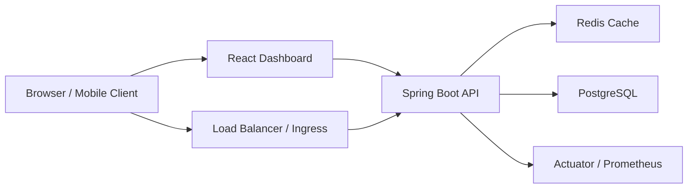
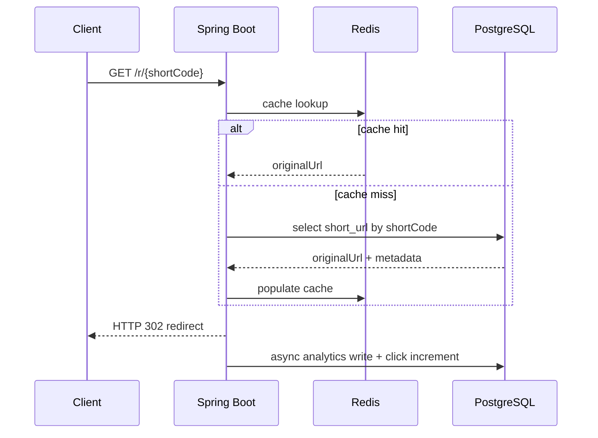
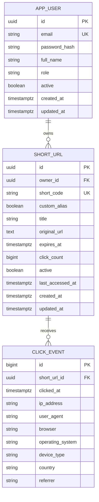

# Distributed URL Shortener System

Production-style, interview-focused URL shortener inspired by Bitly, built with Java Spring Boot, React, PostgreSQL, Redis, Docker, Kubernetes concepts, and Render deployment assets.

This project is intentionally shaped to support system design and software engineering discussions for interviews at companies such as Amazon, Microsoft, Cisco, JPMorgan Chase, Snowflake, Uber, Atlassian, and Google.

## Highlights

- Base62 short-code generation backed by a PostgreSQL sequence
- JWT-based authentication and per-user URL ownership
- Redis cache-aside redirect resolution to reduce hot-path database reads
- URL analytics for click count, timestamp, browser, operating system, device type, IP, and approximate country
- Custom aliases, expiration dates, QR code generation, and bulk URL creation
- Bucket4j rate limiting to protect authentication and URL APIs
- OpenAPI / Swagger documentation
- Docker, Docker Compose, Render configuration, and Kubernetes manifests
- Unit tests and integration-test scaffolding
- Clean layered Spring Boot architecture with controllers, services, repositories, DTOs, configuration, exceptions, and utilities

## Tech Stack

### Backend

- Java 25
- Spring Boot 3.5
- Spring Security
- Spring Data JPA
- PostgreSQL
- Redis
- Flyway
- Bucket4j
- JJWT
- Springdoc OpenAPI
- Micrometer / Prometheus endpoint
- JUnit 5, Mockito, Testcontainers

### Frontend

- React 19
- TypeScript
- Vite
- Material UI
- Recharts
- Axios
- React Router

### Infra

- Docker / Docker Compose
- Kubernetes manifests
- Render deployment config

## Architecture



### Redirect Flow



### Component Responsibilities

- `frontend/`: user-facing dashboard for auth, URL creation, URL management, analytics visualization, filtering, sorting, pagination, and QR access
- `backend/controller/`: REST API and redirect endpoints
- `backend/service/`: business logic, auth, analytics, cache-aside flows, QR generation, redirect behavior
- `backend/repository/`: persistence and optimized query access
- `backend/config/`: security, cache, properties, OpenAPI
- `k8s/`: deployment, service, ingress, HPA, and stateful infrastructure concepts

## System Design Decisions

### Why PostgreSQL?

- Strong relational consistency for users, URLs, and analytics metadata
- Excellent indexing support for short-code lookups and analytics filters
- Familiar interview-friendly operational model
- Sequence support makes Base62 code generation straightforward

### Why Redis?

- Redirects are the highest-volume read path
- Cache-aside design keeps authoritative state in PostgreSQL while Redis absorbs repeated short-code lookups
- TTL-enabled cached records let the system stay fast while preserving consistency through cache refresh and eviction

### Why Base62 + Sequence?

- Compact, URL-safe identifiers
- Deterministic mapping from integer sequence to short code
- Sequence-backed generation avoids random-collision retries under load
- Custom aliases are still supported for product flexibility

### Horizontal Scaling Story

- Multiple stateless backend instances can run behind a load balancer
- JWT auth removes the need for sticky sessions
- Redis centralizes shared cache state
- PostgreSQL remains the source of truth
- Rate limiting can evolve from in-memory Bucket4j buckets to Redis-backed distributed buckets in a larger cluster
- Kubernetes HPA or Render auto-scaling can scale API replicas independently of the frontend

## Database Schema



### Indexing Strategy

- `short_url.short_code`: unique lookup for redirects
- `short_url.owner_id`: dashboard list and ownership checks
- `short_url.created_at`: sorted list view
- `short_url.expires_at`: expiration sweeps and filters
- `click_event.short_url_id`: per-link analytics aggregation
- `click_event.clicked_at`: time-series analytics
- `click_event.country`, `click_event.browser`: breakdown queries

## API Surface

### Authentication

- `POST /api/auth/register`
- `POST /api/auth/login`
- `GET /api/auth/me`

### URL Management

- `POST /api/urls`
- `POST /api/urls/bulk`
- `GET /api/urls`
- `GET /api/urls/{id}`
- `PUT /api/urls/{id}`
- `DELETE /api/urls/{id}`

### Analytics and Dashboard

- `GET /api/urls/{id}/analytics`
- `GET /api/dashboard/summary`

### Public Redirect

- `GET /r/{shortCode}`

### Documentation and Observability

- `GET /swagger-ui.html`
- `GET /v3/api-docs`
- `GET /actuator/health`
- `GET /actuator/prometheus`

## Security Features

- JWT bearer authentication
- BCrypt password hashing
- Ownership validation so users can only manage their own URLs
- Bucket4j rate limiting on auth and URL endpoints
- Centralized exception handling
- Environment-based secrets and infrastructure config
- CORS restricted to the configured frontend origin
- No server-side session affinity required

## Analytics Captured

- Total click count
- Daily click trend
- Browser breakdown
- Operating system breakdown
- Device type breakdown
- Approximate country
- Referrer
- IP address
- Timestamp

Country detection currently prefers CDN / reverse-proxy headers such as `CF-IPCountry`, `X-AppEngine-Country`, or `X-Country-Code`, and falls back to `Local` / `Unknown`. In a production rollout, replace this with a dedicated GeoIP service or MaxMind-based enrichment pipeline.

## Local Development

### Prerequisites

- Java 25
- Node.js 24+
- Docker Desktop

### Backend

```bash
cd backend
./gradlew bootRun
```

### Frontend

```bash
cd frontend
npm install
npm run dev
```

### Docker Compose

```bash
docker compose up --build
```

This starts:

- Frontend on `http://localhost:3000`
- Backend on `http://localhost:8080`
- Swagger UI on `http://localhost:8080/swagger-ui.html`
- PostgreSQL on `localhost:5432`
- Redis on `localhost:6379`

## Environment Variables

Examples are included in:

- [`./.env.example`](./.env.example)
- [`./backend/.env.example`](./backend/.env.example)
- [`./frontend/.env.example`](./frontend/.env.example)

Key runtime variables:

- `SPRING_DATASOURCE_URL`
- `SPRING_DATASOURCE_USERNAME`
- `SPRING_DATASOURCE_PASSWORD`
- `REDIS_HOST`
- `REDIS_PORT`
- `REDIS_PASSWORD`
- `JWT_SECRET`
- `FRONTEND_URL`
- `SHORT_BASE_URL`
- `VITE_API_BASE_URL`

## Docker and Deployment

### Docker Compose

- `docker-compose.yml` orchestrates frontend, backend, PostgreSQL, and Redis
- Backend uses a multi-stage build with the Gradle wrapper
- Frontend uses a multi-stage build and serves assets through Nginx

### Render Deployment

`render.yaml` defines:

- Managed PostgreSQL
- Managed Redis
- Backend Docker web service
- Frontend Docker web service

Suggested Render deployment flow:

1. Push this repository to GitHub.
2. Create a new Render Blueprint deployment from the repository.
3. Review generated services from `render.yaml`.
4. Update frontend and backend public URLs if your actual Render hostnames differ.
5. Trigger the initial deployment.
6. Verify:
   - Backend health endpoint
   - Swagger UI
   - Frontend login flow
   - Redirect behavior
   - Dashboard analytics

Note:
This repo includes Render deployment assets, but I did not execute a live Render deployment from this machine because that requires your Render account and project permissions.

### Kubernetes Concepts

The `k8s/` directory demonstrates:

- Separate frontend and backend deployments
- Backend horizontal pod autoscaling
- ConfigMap + Secret separation
- Redis service
- PostgreSQL StatefulSet
- Ingress split between app and API domains

For real production clusters:

- Prefer managed PostgreSQL and Redis instead of in-cluster stateful workloads
- Add network policies, cert-manager, pod disruption budgets, and external secret managers
- Move analytics writes to a queue for higher redirect throughput

## Observability and Monitoring

- Structured application logging with Logback
- Spring Boot Actuator for health and metrics
- Prometheus scrape endpoint at `/actuator/prometheus`
- Clear exception responses for faster debugging

Recommended next production additions:

- Grafana dashboards
- OpenTelemetry tracing
- ELK / Loki log aggregation
- Alerting on redirect latency, cache hit ratio, DB saturation, and auth anomalies

## Testing

### Implemented

- Unit test for Base62 encoding
- Unit test for URL creation rules and alias conflicts
- Integration-test scaffold with PostgreSQL Testcontainers

### Executed During This Build

- Backend: `./gradlew test`
- Frontend: `npm run build`

## Caching Strategy

### Current Implementation

- Cache-aside on redirect resolution
- Redis key format: `short-url:{code}`
- On miss: load from PostgreSQL, validate expiration, populate Redis
- On write/update/deactivate: refresh or evict the cache

### Production Evolution

- Add explicit TTL based on expiration date
- Track cache hit rate
- Use Redis-backed distributed rate limiting
- Introduce write-behind or event streaming for analytics aggregation

## Scalability Considerations

### Read Path

- Redirects are optimized around Redis
- Short-code lookup uses a unique index
- Stateless backend instances allow horizontal scaling

### Write Path

- PostgreSQL sequence avoids coordination-heavy random ID generation
- Analytics writes can be moved to Kafka / SQS in future versions
- Bulk create currently executes within the API process and can evolve to a background job model for very large batches

### Data Growth

- `click_event` will become the largest table
- Partitioning by date is a natural next step
- Pre-aggregated analytics tables can reduce expensive dashboard scans

## Interview Talking Points

- Why a cache-aside pattern fits the redirect workload
- Why JWT enables horizontal scaling
- Tradeoffs between sequence-based Base62 codes and hash/random generators
- How to evolve from synchronous analytics writes to queued ingestion
- Index design for short-code lookup and analytics queries
- Load balancer behavior across stateless API instances
- How Redis and rate limiting should change in a multi-region deployment
- Why the frontend is separated from the API and can scale independently

## Suggested Git Workflow

- `main` for stable releases
- `feature/<capability>` or `codex/<capability>` branches for work streams
- Pull requests with architecture notes, test evidence, and rollout impact
- Meaningful commits such as:
  - `feat(api): add JWT auth and URL ownership checks`
  - `feat(redirect): add Redis cache-aside resolution`
  - `feat(ui): build analytics dashboard with filtering and pagination`
  - `chore(infra): add docker compose and render blueprint`

## Repository Structure

```text
.
├── backend
│   ├── src/main/java/com/urlshortener
│   ├── src/main/resources
│   └── Dockerfile
├── frontend
│   ├── src
│   └── Dockerfile
├── k8s
├── docker-compose.yml
├── render.yaml
└── README.md
```

## Future Enhancements

- Refresh tokens and email verification
- Role-based admin moderation
- Distributed Bucket4j with Redis or Hazelcast
- Kafka-based analytics ingestion
- GeoIP enrichment service
- Link tags, folders, and team collaboration
- Custom domains per tenant
- S3-backed export jobs for analytics
- Blue/green or canary deployment strategy

## What Was Verified

- Backend test suite passes locally with `./gradlew test`
- Frontend production build passes locally with `npm run build`

What was not executed from this machine:

- Live Render deployment
- End-to-end browser QA against a running local stack
- A full Docker Compose smoke test

Those assets are included and ready, but they require either longer runtime orchestration or your cloud account access for the final mile.
