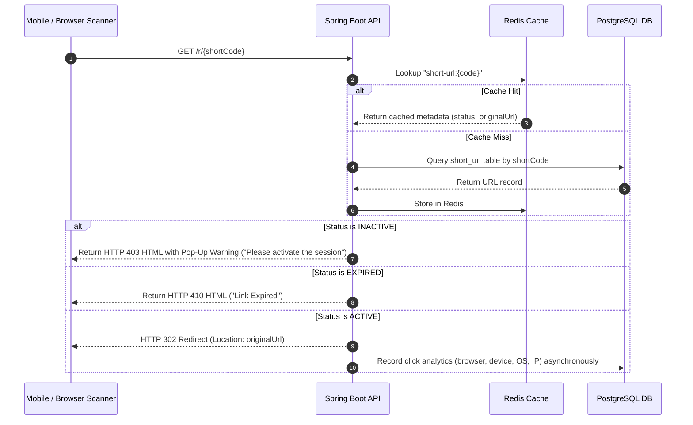
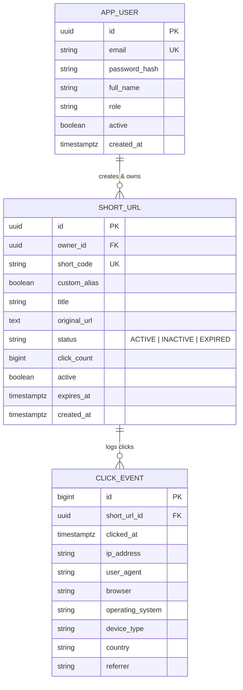

# Distributed URL Shortener & Analytics Platform

Production-style, scalable URL Shortener Platform inspired by Bitly, built with **Spring Boot**, **PostgreSQL**, **Redis**, **React 19**, **Docker**, **Flyway**, **JWT Authentication**, and **Swagger/OpenAPI**.

This project demonstrates backend engineering, system design, high-performance caching, real-time analytics, mobile QR scanning, and deployment readiness for engineering interviews at top tech companies.

---

## 🌟 Simple Explanation: How It Works

Imagine you have a long web link like `https://example.com/products/category/item/12345`. Sharing this link in messages, SMS, or QR codes looks messy.

This system takes that long URL and compresses it into a short, 6-character code like `http://192.168.1.15:8080/r/Q0u`.

### 1. Link Creation & Shortening
- You enter a long URL in the dashboard.
- The backend generates a unique sequence number in PostgreSQL and encodes it using **Base62** (`0-9`, `a-z`, `A-Z`).
- A scannable **QR code** is generated automatically.

### 2. Fast Redirection with Caching
- When someone clicks or scans `http://.../r/Q0u`:
  1. The backend first checks **Redis Cache**.
  2. If cached, it immediately redirects the browser (**HTTP 302 Found**) to the long URL.
  3. If not cached, it reads from **PostgreSQL**, updates Redis, and redirects.
  4. The click details (browser, device type, OS, timestamp) are recorded for analytics.

### 3. Inactive Links & Pop-up Warning ⚠️
- You can turn links **ON (ACTIVE)** or **OFF (INACTIVE)** anytime from your dashboard.
- If a link is **INACTIVE**:
  - It **will NOT redirect** to the target site.
  - Instead, the browser displays a modern **Pop-Up Overlay Warning**:
    > **⚠️ Please activate the session / URL from your dashboard to enable redirection.**

### 4. Mobile QR Code Scanning 📱
- QR codes generated by the app automatically detect your computer's local Wi-Fi IP address (e.g. `192.168.x.x`).
- Any mobile phone connected to the same Wi-Fi can scan the QR code directly using its camera and be redirected immediately.

---

## 🏗️ System Architecture

```mermaid
flowchart LR
    subgraph Clients
        Mobile["📱 Mobile Phone (QR Scan)"]
        Browser["💻 Desktop Browser / Dashboard"]
    end

    subgraph Application Stack
        FE["React 19 Frontend (Vite + Material UI)"]
        API["Spring Boot 3.5 REST API"]
    end

    subgraph Infrastructure
        Redis[("Redis Caching")]
        DB[("PostgreSQL Database")]
        Prometheus["Actuator / Prometheus Metrics"]
    end

    Browser --> FE
    FE --> API
    Mobile -->|GET /r/{shortCode}| API
    API <-->|Cache-Aside Lookup| Redis
    API <-->|Persist / Load URLs & Analytics| DB
    API --> Prometheus
```

### Redirect Flow Sequence Diagram


```mermaid
sequenceDiagram
    autonumber
    participant Client as Mobile / Browser Scanner
    participant API as Spring Boot API
    participant Cache as Redis Cache
    participant DB as PostgreSQL DB

    Client->>API: GET /r/{shortCode}
    API->>Cache: Lookup "short-url:{code}"
    
    alt Cache Hit
        Cache-->>API: Return cached metadata (status, originalUrl)
    else Cache Miss
        API->>DB: Query short_url table by shortCode
        DB-->>API: Return URL record
        API->>Cache: Store in Redis
    end

    alt Status is INACTIVE
        API-->>Client: Return HTTP 403 HTML with Pop-Up Warning ("Please activate the session")
    else Status is EXPIRED
        API-->>Client: Return HTTP 410 HTML ("Link Expired")
    else Status is ACTIVE
        API-->>Client: HTTP 302 Redirect (Location: originalUrl)
        API->>DB: Record click analytics (browser, device, OS, IP) asynchronously
    end
```

---

## 🗄️ Database Schema


```mermaid
erDiagram
    APP_USER ||--o{ SHORT_URL : "creates & owns"
    SHORT_URL ||--o{ CLICK_EVENT : "logs clicks"

    APP_USER {
        uuid id PK
        string email UK
        string password_hash
        string full_name
        string role
        boolean active
        timestamptz created_at
    }

    SHORT_URL {
        uuid id PK
        uuid owner_id FK
        string short_code UK
        boolean custom_alias
        string title
        text original_url
        string status "ACTIVE | INACTIVE | EXPIRED"
        bigint click_count
        boolean active
        timestamptz expires_at
        timestamptz created_at
    }

    CLICK_EVENT {
        bigint id PK
        uuid short_url_id FK
        timestamptz clicked_at
        string ip_address
        string user_agent
        string browser
        string operating_system
        string device_type
        string country
        string referrer
    }
```

---

## 🛠️ Tech Stack

| Layer | Technology | Purpose |
| :--- | :--- | :--- |
| **Backend Framework** | Java 25 + Spring Boot 3.5 | High-performance RESTful API microservice |
| **Database** | PostgreSQL | Relational database for persistent storage |
| **Caching Layer** | Redis | In-memory cache for ultra-fast link redirects |
| **Migrations** | Flyway | Database schema version control |
| **Frontend Framework**| React 19 + TypeScript + Vite | Interactive dashboard with real-time charts |
| **UI Components** | Material UI (MUI) + Recharts | Responsive component design & analytics visualization |
| **Security** | Spring Security + JWT + Bucket4j | JWT token authentication & rate limiting |
| **Containerization** | Docker + Docker Compose | Full-stack containerized local deployment |
| **API Specs** | Springdoc OpenAPI / Swagger | Interactive API documentation |

---

## 🚀 Quick Start Guide

### Prerequisites
Make sure you have installed:
- [Docker Desktop](https://www.docker.com/products/docker-desktop/)
- Node.js 20+ (optional if using Docker)
- Java 21+ / Java 25 (optional if using Docker)

---

### Option 1: Run Full Stack via Docker Compose (Recommended)

Run the entire application (PostgreSQL, Redis, Spring Boot Backend, and React Frontend) with a single command:

1. **Open your terminal or PowerShell:**
   ```powershell
   cd "D:\System Design Project\URL Shortener System"
   ```

2. **Start the containers:**
   ```powershell
   docker compose up --build
   ```

3. **Open the applications in your browser:**
   - 🌐 **Frontend App:** [http://localhost:3000](http://localhost:3000)
   - ⚙️ **Backend API:** [http://localhost:8080](http://localhost:8080)
   - 📘 **Swagger UI:** [http://localhost:8080/swagger-ui.html](http://localhost:8080/swagger-ui.html)
   - 💚 **Health Check:** [http://localhost:8080/actuator/health](http://localhost:8080/actuator/health)

4. **Stop the stack:**
   ```powershell
   docker compose down
   ```

---

### Option 2: Hybrid Local Development Mode

Run database dependencies in Docker while developing frontend and backend locally:

1. **Start PostgreSQL & Redis:**
   ```powershell
   docker compose up -d postgres redis
   ```

2. **Run Backend (Terminal 1):**
   ```powershell
   cd backend
   .\gradlew.bat bootRun
   ```

3. **Run Frontend (Terminal 2):**
   ```powershell
   cd frontend
   npm install
   npm run dev
   ```

   - Frontend: [http://localhost:5173](http://localhost:5173)
   - Backend: [http://localhost:8080](http://localhost:8080)

---

## 📱 Mobile QR Code Scanning Instructions

1. Ensure your **mobile phone** and **computer** are connected to the **same Wi-Fi network**.
2. Open the URL Shortener Dashboard on your computer.
3. Click the **QR Code icon** next to any URL in your table.
4. Open your mobile phone's Camera or QR scanner and scan the QR code on screen.
5. Your phone will open the link:
   - If **ACTIVE**: Redirects instantly to the destination site.
   - If **INACTIVE**: Displays the **Pop-up Card Overlay**: *"⚠️ Please activate the session / URL from your dashboard to enable redirection."*

---

## 🔑 Key API Endpoints

### 🔐 Authentication
- `POST /api/auth/register` - Create user account
- `POST /api/auth/login` - Authenticate and get JWT token
- `GET /api/auth/me` - Get logged-in user profile

### 🔗 URL Management
- `POST /api/urls` - Create short URL (optional custom alias & expiration)
- `GET /api/urls` - List user URLs with pagination, search & status filter (`ALL`, `ACTIVE`, `INACTIVE`, `EXPIRED`)
- `PATCH /api/urls/{id}/activate` - Set status to `ACTIVE`
- `PATCH /api/urls/{id}/deactivate` - Set status to `INACTIVE`
- `DELETE /api/urls/{id}` - Delete short URL

### 📊 Analytics & Redirect
- `GET /r/{shortCode}` - Public redirect route (returns 302 or Inactive HTML warning)
- `GET /api/urls/{id}/analytics` - Detailed click analytics (browsers, devices, OS, countries)
- `GET /api/dashboard/summary` - Aggregate metrics for user dashboard

---

## 💡 System Design & Interview Talking Points

- **Why Cache-Aside Pattern?** Reduces database load by ~95% for read-heavy short link redirect traffic.
- **Why Base62 Encoding?** Converts sequence IDs into compact, URL-safe strings (`A-Z`, `a-z`, `0-9`) without hash collision handling overhead.
- **Why Explicit Status Lifecycle?** Differentiates between intentional manual deactivation (`INACTIVE`) and temporal expiration (`EXPIRED`).
- **How Mobile LAN Resolution Works?** Automatically resolves `localhost` to site-local IPv4 addresses so QR codes remain scannable across network interfaces.

---

## 📁 Repository Structure

```text
URL Shortener System/
├── backend/
│   ├── src/main/java/com/urlshortener/
│   │   ├── config/          # Security, Redis & App properties
│   │   ├── controller/      # Auth, URL, Redirect & Dashboard APIs
│   │   ├── exception/       # Exception handlers & HTML error pages
│   │   ├── model/          # JPA entities (AppUser, ShortUrl, ClickEvent)
│   │   ├── repository/     # Spring Data JPA repositories
│   │   ├── service/        # Business logic, Caching & Mapping
│   │   └── util/           # Network LAN detection & QR generation
│   ├── src/main/resources/ # application.yml & Flyway migrations
│   └── Dockerfile
├── frontend/
│   ├── src/
│   │   ├── components/     # Layout, Navbar, Auth forms
│   │   ├── pages/          # Dashboard, Analytics & QR modal
│   │   ├── state/          # Auth context & state management
│   │   └── types.ts        # TypeScript definitions
│   └── Dockerfile
├── docker-compose.yml       # Full stack container configuration
└── README.md                # Project documentation
```

---

## 📄 License

This project is open-source and available under the **MIT License**.
